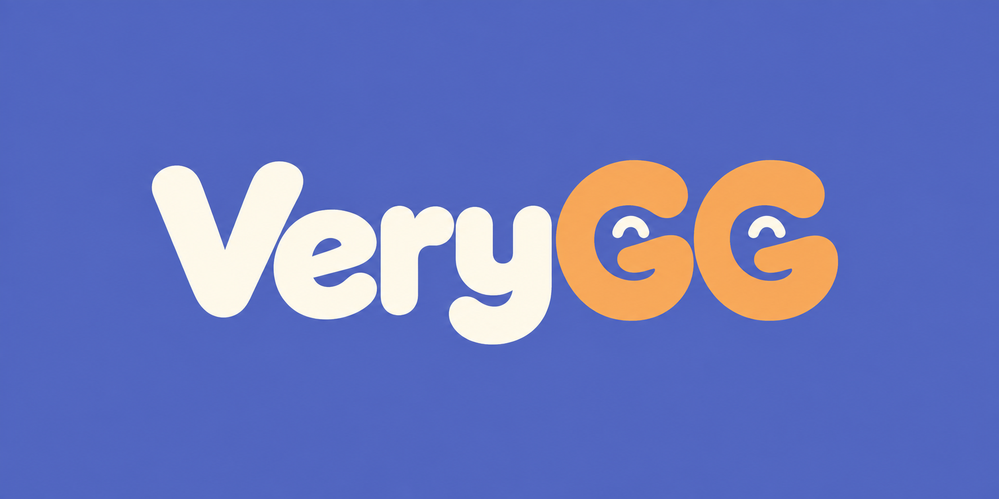

# VeryGG

**VeryGG**, initialement nommé **Very-good-game**, est un studio de création de jeux vidéo pour mobile.

## Le projet

VeryGG développe son identité et prépare sa présence en ligne autour de son activité de studio de jeux mobiles.

Le projet comprend la présentation du studio et la préparation de son futur site web. Les jeux, leurs fonctionnalités et leurs dates de sortie seront précisés au fil du développement.

## Site web

Le site a vocation à présenter le studio et à mettre en avant ses jeux. Sa structure et ses contenus restent à définir.

## État d’avancement

- Nom retenu : **VeryGG**.
- Activité : création de jeux vidéo pour mobile.
- Identité visuelle : en cours de finalisation.
- Site web : en préparation.

## Informations à compléter

- Présentation de l’équipe.
- Premiers jeux et plateformes ciblées.
- Liens de téléchargement lorsque les jeux seront disponibles.
- Coordonnées de contact et réseaux du studio.

## Développement

Aucun code applicatif ni environnement de développement n’est présent dans ce dossier à ce stade. Les instructions d’installation et de lancement seront ajoutées lorsque le développement du site ou des jeux commencera.
